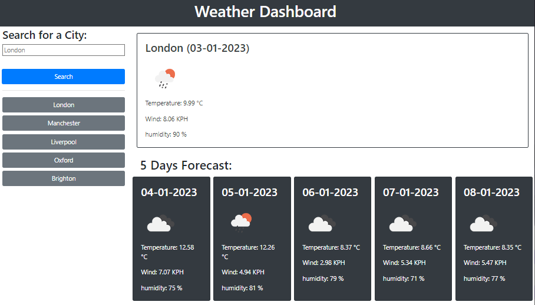

# Weather-Dashboard

This project is a weather forecast application that utilizes the OpenWeatherMap API to retrieve weather data for a given city. It displays the current weather and a 5-day forecast for the selected city.

## Installation

1. Clone the repository to your local machine:

```git clone https://github.com/[username]/openweathermap-api-weather-forecast.git```

2. Install the required dependencies:

```npm install```

3. Compile the TypeScript source code:

```npm run build```

4. Open the `index.html` file in your browser to run the application.

## Usage



1. Enter a city name in the search input field.
2. Click the search button.
3. The current weather and 5-day forecast for the selected city will be displayed on the page.

## Dependencies

- jQuery: Used for making AJAX requests and manipulating the DOM.
- Moment.js: Used for formatting dates.

## License

This project is licensed under the MIT License. See the [LICENSE](LICENSE) file for details.

